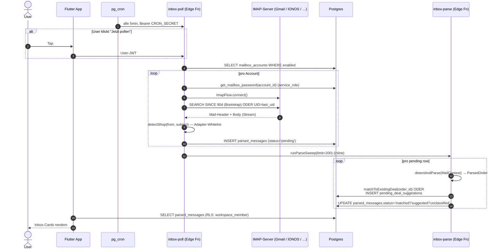

# 04 — Inbox- & Mail-Pipeline

Die Inbox ist die größte technisch eigenständige Funktion der App. Sie:

1. Holt alle 5 Minuten Mails aus IMAP-Postfächern.
2. Klassifiziert pro Mail einen *Shop* anhand der Adapter-Registry.
3. Extrahiert Felder (`order_id`, `tracking`, `total`, …) und schreibt sie
   ins Backend.
4. Schlägt entweder einen neuen Deal vor (`pending_deal_suggestion`) oder
   matched die Mail an einen bestehenden Deal.
5. Zeigt das Resultat im Inbox-Tab und triggert UI-Updates.

Dieses Kapitel erklärt jeden Schritt. Wenn du eine Mail debuggst, die nicht
ankam oder falsch klassifiziert wurde, ist das die richtige Lektüre.

> Begriffe wie *Workspace*, *Deal*, *Adapter* sind im
> [Glossar](10-glossary.md) erklärt.

## End-to-End-Sequenz



## inbox-poll — IMAP-Holzhammer

Datei:
[`supabase/functions/inbox-poll/index.ts`](../../supabase/functions/inbox-poll/index.ts)

Triggers:

- **pg_cron** (alle 5 Minuten, mit `Authorization: Bearer <CRON_SECRET>`).
- **service_role** (interner Aufruf, z.B. aus anderen Functions).
- **User-JWT** (UI-Button "Jetzt pollen"). Hier wird der Lauf auf
  Workspaces beschränkt, in denen der User Mitglied ist.

Pro Lauf:

1. Lade alle `mailbox_accounts WHERE enabled = TRUE` (gefiltert auf
   `allowedWorkspaceIds`, falls User-Pfad).
2. Für jedes Account: `get_mailbox_password(account_id)` (RPC,
   `service_role`-only) → Klartext-PW.
3. ImapFlow connect → Folder open.
4. **Bootstrap** (erstes Mal pro Account): `SEARCH SINCE`
   `BOOTSTRAP_LOOKBACK_DAYS=90` Tage. Vermeidet, dass volle Postfächer den
   ersten Lauf endlos machen.
5. **Incremental**: `UID > last_uid`.
6. Hard cap pro Lauf: `MAX_FETCH_PER_RUN = 100` Mails. Memory-Limit der
   Edge Function ist 150MB — alles drüber fängt der nächste Tick.
7. Pro Mail: `shouldStore(ctx)` (Adapter sagt "ja, sieht aus wie Order")
   → INSERT `parsed_messages` mit `status='pending'` und
   `parsed_payload=null` (Body landet nicht in der DB!).
8. Am Ende: `runParseSweep` *inline* aufrufen (siehe nächster Abschnitt) —
   spart einen extra HTTP-Roundtrip.

Wichtig: **Body wird nicht persistiert.** Nur Header (`from`, `subject`,
`received_at`) plus später das extrahierte JSON. DSGVO-Compliance hat
Vorrang vor Forensik-Tiefe.

## Adapter-Registry

Datei:
[`supabase/functions/_shared/inbox_adapters.ts`](../../supabase/functions/_shared/inbox_adapters.ts)

Aktuell registrierte Shops (`ADAPTERS`-Liste):

- `amazon` (DE/COM/UK/FR/IT/ES)
- `mediamarkt`
- `saturn`
- `pccomponentes`
- `xkom`

Pro Adapter drei Funktionen:

```ts
interface Adapter {
  matches: (ctx: MailContext) => boolean      // Whitelist-Check
  looksLikeOrder: (ctx: MailContext) => boolean
  parse: (ctx: MailContext) => ParsedOrder | null
}
```

### `matches`

Prüft die `from`-Domain. Bsp.: Amazon matcht alle
`@*.amazon.{de,com,co.uk,fr,it,es}`-Adressen. Ist die einzige Stelle, an
der Promotion-Mails herausgefiltert werden — ohne Match landet die Mail
*gar nicht* in der DB.

### `looksLikeOrder`

Subject/Body-Pattern, das Order-/Versand-/Stornierungs-Mails erkennt
(Negativ: Newsletter, Account-Hinweise). Wird im inbox-poll als zweite
Stufe geprüft.

### `parse`

Extrahiert die strukturierten Felder. Darf `null` zurückgeben — dann landet
die Mail im "Unklassifiziert"-Tab mit gesetztem `shop_key`, der User kann
manuell daraus einen Deal machen.

Felder im `ParsedOrder`-Interface:

| Feld | Typ | Beispiel |
|---|---|---|
| `shopKey` | `'amazon' \| …` | `'amazon'` |
| `orderId` | `string?` | `'304-1234567-7654321'` |
| `product` | `string?` | `'Lego Star Wars 75301'` |
| `quantity` | `number` | `1` |
| `total` | `number?` | `89.99` |
| `currency` | `string` | `'EUR'` |
| `tracking` / `trackings` | `string` / `string[]?` | `['1Z123…', 'JD12345…']` |
| `carrier` | `string?` | `'DHL'` |
| `eta` / `etaDate` | `string?` | `'2026-05-12'` |
| `shippedAt` | ISO | `'2026-05-08T13:21:00Z'` |
| `orderTotal` | `{amount, currency}` | `{amount: 89.99, currency: 'EUR'}` |
| `taxRatePct` | `number?` | `19` |
| `shippingAddressCountry` | `'DE' \| 'AT' \| …` | `'DE'` |
| `items[]` | `ParsedOrderItem[]` | für Multi-Article-Bestellungen |
| `seller` | `string?` | für Marketplace-Verkäufer |
| `cancellationReason` | `string?` | nur bei Storno |

### HTML-Forensik

Adapter parsen sowohl Plaintext als auch HTML. Begründung: Amazon liefert
Tracking-Nummern oft *nur* als URL-Parameter
(`&shipmentDate=…&trackingId=…`), nicht im Plaintext. Die Forensik-Tests
unter
[`supabase/functions/_shared/inbox_forensics_test.ts`](../../supabase/functions/_shared/inbox_forensics_test.ts)
sind die Wahrheit, ob ein Adapter alles aus einer Mail rausholt, was geht.

Strong-Tracking-Pattern (in `STRONG_TRACKING_PATTERNS`):

- `1Z…` (UPS), `TBA…` (Amazon), `JJD…` / `JD…` (DHL), `[LL]NNN…NN[LL]`
  (DE-DHL).

Schwächere Pattern (rein numerische Nummern) werden **nur** akzeptiert,
wenn direkt ein Schlüsselwort wie "Tracking", "Sendungsnummer" oder
"Paketnummer" davorsteht — sonst Risiko, dass interne Shipment-IDs
fälschlich als Tracking interpretiert werden.

## Strict-Tracking-Extraction (Confidence-Modell)

Seit Plan
[`plans/2026-05-13_strict_tracking_extraction.md`](../../plans/2026-05-13_strict_tracking_extraction.md)
gilt: eine Tracking-Nummer landet **nur** dann in `deals.tracking`,
`pending_deal_suggestions.tracking` oder `parsed_messages.parsed_payload.tracking`,
wenn drei Bedingungen erfüllt sind — strukturierte Carrier-URL **oder**
Strong-Pattern mit Anchor-Wort im selben Sentence-Window, bestandene
Validierung (Länge + Charset + Checksum, soweit möglich), und
`confidence === 'strong'`. Alles andere → `tracking = NULL`,
`tracking_confidence = 'none'`, `tracking_needs_review = TRUE`.

### Pipeline-Order

1. **Body-Cap** auf 256 KB (ReDoS-Mitigation).
2. **Anchor-Detection**: Sentence-Window-Scan auf DE/EN/FR/IT/ES/PL-Anker
   (`Sendungsnummer`, `Tracking`, `Sendungsverfolgung`, `numéro de
   suivi`, …).
3. **Whitespace-Normalisierung** vor jedem Pattern-Match
   (`candidate.replace(/[\s ]+/g, '')`) — sonst killt der Strict-Mode
   legitime UPS-Trackings wie `1Z 999 AA1 0123456784`.
4. **Pattern-Match** auf den normalisierten Token. Die numerischen Pattern
   (DHL-20/-12, DPD-14, GLS) sind seit Paket 2 **Leerzeichen-tolerant**:
   sie erlauben EINZELNE Spaces/NBSPs zwischen den Ziffern
   (`DE 5455 2798 39`, gruppierte PDF-Trackings) und kapseln den Match per
   Lookaround-Guards (`(?<!\d[  ])…(?![  ]?\d)`), damit keine
   längeren Zahlenketten angeschnitten werden. Ein **globaler**
   Whitespace-Strip des Bodies bleibt verboten — die Validatoren
   (mod-10-Checksums, exakte Längen, Name-Anchors) laufen weiterhin auf dem
   normalisierten Token, ein zufälliger Zahlen-Mix fällt dort durch.
5. **Reject-Filter** (`REJECT_PATTERNS`, läuft NUR gegen den 3–30-Zeichen-
   Token): Amazon-Order-IDs (`123-1234567-1234567`), IBAN-Prefixe, Tele-
   fonnummern, PLZ. Reject-Hits werden in
   `parsed_payload.tracking_candidates[].validation.rejectedBy` geloggt.
6. **Validator** via vendoreter
   [`jkeen/tracking_number_data`](https://github.com/jkeen/tracking_number_data)
   in [`supabase/functions/_shared/tracking_data/`](../../supabase/functions/_shared/tracking_data/)
   + Dünner Deno-Interpreter in
   [`tracking_validators.ts`](../../supabase/functions/_shared/tracking_validators.ts).
7. **Confidence-Assignment** (`strong | medium | weak` intern).

### Confidence-Stufen

| Wert | Bedeutung | Wirkung |
|---|---|---|
| `strong` | URL-eingebettet **oder** Anchor + Strong-Pattern + bestandene Validierung | wird in `deals.tracking` / `pending_deal_suggestions.tracking` geschrieben |
| `manual` | Vom User per Hand eingetragen | nur auf `deals` möglich, niemals maschinell überschreibbar |
| `none` | Keine sichere Erkennung | `tracking = NULL`, `tracking_needs_review = TRUE` |

`medium` und `weak` existieren intern als Candidates (Forensik in
`parsed_payload.tracking_candidates[]`), erreichen aber niemals die
Persistenz-Felder — `CHECK`-Constraints lehnen die Werte ab. Der
Amazon-`orderingShipmentId`-Sonderfall ist `medium` mit
`source: 'amazon-shipment-id'` und löst im UI den Hinweis
„Amazon-interne Shipment-ID — kein vollwertiges Carrier-Tracking" aus.

### `TrackingCandidate`-Typ

```ts
interface TrackingCandidate {
  value: string                       // normalisiert, ohne Whitespace
  carrier?: string
  confidence: 'strong' | 'medium' | 'weak'
  source: 'strong-pattern' | 'context-anchor' | 'html-carrier-url'
        | 'html-generic-url' | 'amazon-shipment-id'
  anchorMatched?: string              // max 50 chars, NUR das Anchor-Wort
  validation: { lengthOk, checksumOk?, rejectedBy? }
}
```

`anchorMatched` ist auf 50 Zeichen begrenzt (PII-Schutz) und enthält
NUR das Anchor-Wort, niemals nachgestellten Folge-Text.

### Forward-Only-Schreib-Regel (Dart)

Datei
[`lib/services/inbox_match_service.dart`](../../lib/services/inbox_match_service.dart).
`shouldWriteTracking` deckt sechs Cases ab und überschreibt nur dann
einen bestehenden Wert, wenn die neue Erkennung `'strong'` ist UND der
alte Wert entweder leer ist oder `tracking_needs_review = TRUE` trägt.
`'manual'`-Einträge bleiben immer unverändert.

### Re-Parse-Modi

`inbox-parse` kennt vier Modi (siehe auch [07 — Edge
Functions](07-edge-functions.md#inbox-parse)):

| Mode | Effekt |
|---|---|
| Default (kein Flag) | `runParseSweep(limit=200)` auf pending Rows |
| `reparse_unclassified` | alte `status='unclassified'` neu klassifizieren |
| `reparse_no_tracking` | gezielt Mails ohne Tracking neu parsen |
| `reparse_forensics` | Forensik-Erweiterung auf historischen Mails |
| `reparse_low_confidence` | alle `tracking_needs_review=TRUE`-Mails mit dem Strict-Detector neu prüfen |

Alle Re-Parse-Modi lesen **beide** Body-Quellen (`_raw_html` UND
`_raw.text`) — sonst Regression auf Plain-Text-only-Mails. Der UI-
Trigger sitzt in
[`lib/screens/settings_screen.dart`](../../lib/screens/settings_screen.dart)
(„Sendungsnummern neu bewerten") und respektiert das 5-Minuten-Cooldown
aus `mailbox_accounts.last_reparse_at`.

### `tracking-poll`-Skip

`tracking-poll` skipped seit T16 alle Deals mit
`tracking_needs_review = TRUE` UND `tracking_confidence = 'none'` —
sonst würden API-Calls gegen leere Trackings laufen.

## Carrier-Registry & Detection-only-Carrier

Die kanonische Liste aller Carrier lebt seit Paket 2 in
[`supabase/functions/_shared/carriers.ts`](../../supabase/functions/_shared/carriers.ts)
— eine **Quelle der Wahrheit** statt drei driftender Definitionen. Pro
Carrier: `detection` (von der Mail-Detection erkannt?), `pollAdapter`
(hat einen Live-Status-Poll?), `requiresApiKey`, `uiEnabled`
(in Settings → Versand freigeschaltet) und `publicTrackingPage`
(Deep-Link verfügbar). Aus `detection && !pollAdapter` wird das
`DETECTION_ONLY_CARRIERS`-Set abgeleitet; die Dart-Spiegel
([`carrier_credential.dart`](../../lib/models/carrier_credential.dart),
[`carrier_links.dart`](../../lib/utils/carrier_links.dart)) werden per
`carriers_test.ts` gegen die Registry geprüft.

| Carrier | detection | pollAdapter | UI | Notiz |
|---|---|---|---|---|
| `dhl` | ✓ | ✓ | ✓ | Parcel-DE-API, Cap 900/Tag |
| `dpd` | ✓ | ✓ | ✓ | seit Paket 2 in Settings freigeschaltet |
| `ups` | ✗ | ✓ | ✗ | Adapter vorhanden, `1Z` bewusst nicht geroutet, UI gesperrt bis OAuth-Flow |
| `amazon` | ✓ | ✗ | ✗ | **detection-only** — keine öffentliche API, kein Deep-Link |
| `gls` | ✓ | ✗ | ✗ | **detection-only** (neu Paket 2) — Deep-Link, Status mail-getrieben |

**Detection-only-Carrier** (`amazon`, `gls`) werden zwar in Mails erkannt
und setzen `deals.carrier`, aber **nie** von `tracking-poll` abgefragt
(`DETECTION_ONLY_CARRIERS`-Short-Circuit). Ihr Live-Status bleibt
mail-getrieben; die UI bietet nur den Deep-Link zur Carrier-Paketverfolgung.

### GLS-Detection (Doppel-Gate)

GLS (neu in Paket 2 — PcComponentes & Co. versenden via GLS) hat **keine
öffentliche Checksum**. Die numerischen GLS-Pattern (`gls-num`, 11–20
Ziffern, inkl. GLS-Spain-20-Format) sind deshalb wie DPD doppelt
gegated: ein Tracking-**Anchor** ist Pflicht (`requiresAnchor`) UND das
Wort „GLS" muss explizit im 80-Zeichen-Fenster vor dem Match stehen
(`glsNameInWindow`) — sonst Drop. HTML-`href`-Treffer auf GLS-
Paketverfolgungs-Links (`gls-group.eu`/`gls-pakete.de`/nationale Ableger,
Param `match=`/`txtRefNo=`) gelten direkt als `strong`.

### Re-Parse-Korrektur (strictly-stronger Replace)

Bis Paket 2 schrieb der Re-Parse ein Tracking nur, wenn der Deal noch
**keins** hatte (forward-only). Jetzt darf ein neu erkanntes, validiertes
Tracking ein bestehendes **falsches** ersetzen — geregelt von der reinen
Funktion `shouldReplaceTracking` in
[`inbox_parse_runner.ts`](../../supabase/functions/_shared/inbox_parse_runner.ts).
Bedingungen (alle nötig):

- die neue Detection ist `'strong'` (validiert),
- der alte Wert ist **nicht** `'manual'` (User-Eingabe wird nie
  überschrieben),
- der alte Wert trägt `tracking_needs_review = TRUE` ODER ist nicht-strong
  (`none`/`null`/Legacy).

Ein `strong → strong`-Konflikt bleibt unangetastet (kein Ping-Pong
zwischen zwei validierten Werten — das wäre Cross-Mail-Mehrdeutigkeit).
Beim Replace werden die Flags korrigiert (`tracking_confidence='strong'`,
`tracking_needs_review=false`) und die Live-Status-Felder des alten
Trackings genullt (`live_status`/`live_eta`/`last_polled_at` = NULL), damit
die UI keinen stale Status zeigt und der adaptive Poller die neue Nummer
sofort frisch bewertet. Die `tracking_events`-Timeline bleibt erhalten —
sie ist per Dedup-Key an die Tracking-Nummer gebunden und filtert sich
selbst.

## inbox-parse — Klassifizierung & Match

Datei:
[`supabase/functions/inbox-parse/index.ts`](../../supabase/functions/inbox-parse/index.ts)

Wird:

1. **Inline** vom `inbox-poll` als `runParseSweep(admin, {limit: 200})`
   aufgerufen (Standard).
2. **Manuell** aufgerufen, wenn der User im UI auf "Re-Parse" klickt.
3. Mit speziellen Body-Optionen:
   - `{reparse_unclassified: true}` — alte unklassifizierte Mails gegen die
     neue Adapter-Registry sweepen.
   - `{reparse_no_tracking: true, workspace_id, shop_key}` — gezielt Mails
     ohne Tracking neu parsen.
   - `{reparse_forensics: true, workspace_id, shop_key}` — Forensik-
     Erweiterung auf historischen Mails laufen lassen.
   - `{reparse_low_confidence: true}` — Strict-Tracking-Re-Evaluation auf
     allen `tracking_needs_review=TRUE`-Mails des Workspaces, 5-Minuten-
     Cooldown via `mailbox_accounts.last_reparse_at`.

`runParseSweep` aus
[`_shared/inbox_parse_runner.ts`](../../supabase/functions/_shared/inbox_parse_runner.ts):

1. Lade alle `parsed_messages WHERE status='pending'` (limit 200).
2. Pro Row: `detectAndParse(ctx)` → `ParsedOrder | null`.
3. `null` → `status='unclassified'` (User muss manuell Deal anlegen).
4. Erfolgreich: prüfe ob `order_id` schon in `deals.ticket_number` oder
   `parsed_messages.parsed_payload->>'orderId'` existiert. Wenn ja:
   `status='matched'`, `match_deal_id` setzen.
5. Sonst: INSERT in `pending_deal_suggestions`, `status='suggested'`.

## Klassifizierungs-Status-Tabelle

| Status | Bedeutung | UI-Tab |
|---|---|---|
| `pending` | Eben gepollt, noch nicht geparst | unsichtbar (Inbetween-State) |
| `matched` | Mail einem bestehenden Deal zugeordnet | Eingang (mit Deal-Link) |
| `suggested` | Adapter sagt "neuer Deal-Vorschlag" | Vorschläge |
| `unclassified` | Adapter konnte nichts extrahieren | Eingang (mit Manual-Action) |
| `failed` | Fehler beim Parsen (Exception) | Eingang (mit Fehlermeldung) |
| `dismissed` | User hat per Hand "ablehnen" geklickt | unsichtbar |

## Tracking-Pipeline (parallel)

Datei:
[`supabase/functions/tracking-poll/index.ts`](../../supabase/functions/tracking-poll/index.ts)

Wird seit Paket 1.5 **stündlich** per pg_cron getriggert
(`tracking-poll-adaptive`, `mode='adaptive-sweep'`), mit adaptiver
In-Function-Frequenz, Quiet-Hours (Berlin 22–05) und Tages-Quota-Guard.
Ablauf:

1. Lade alle aktiven `workspace_carrier_credentials`.
2. Pro Workspace: lade alle offenen Deals
   (`status='Unterwegs'`, `tracking IS NOT NULL`, `arrival_date IS NULL`),
   filtere auf **fällige** Deals (`out_for_delivery` stündlich,
   `in_transit` ~4h, `pending` 2×/Tag).
3. Pro Deal: erkenne Carrier aus Tracking-Nummer (Adapter aus
   [`tracking_adapters.ts`](../../supabase/functions/_shared/tracking_adapters.ts))
   und ruf den Carrier-API-Endpoint mit gespeichertem API-Key auf;
   persistiere den vollen Event-Verlauf in `tracking_events`.
4. Bei `delivered`: setze Deal `status='Angekommen'` + `arrival_date`,
   schreib `activity_log`. Bei jedem Status-Wechsel: Push.

Details (adaptive Gating, Quota, Status-Push) siehe
[07 — Edge Functions](07-edge-functions.md#tracking-poll).

## Dedup-Logik

`parsed_messages` hat zwei UNIQUE-Indexe:

- `parsed_messages_uniq_uid` über `(account_id, message_uid)` — verhindert,
  dass dieselbe IMAP-UID doppelt gespeichert wird.
- `parsed_messages_uniq_hash` über `(account_id, message_hash)` — verhindert
  Doppel-Inserts, wenn ein IMAP-Server eine Mail re-numeriert.

Der Hash kommt aus `from + subject + received_at + body-prefix(2KB)`.

## Retention

`cleanup_inbox_history()` löscht täglich um 03:15 UTC alle
`parsed_messages` älter als 30 Tage und alle ungelösten
`pending_deal_suggestions` älter als 30 Tage. Aktive Deals sind nicht
betroffen — die `match_deal_id`-Verknüpfung ist `ON DELETE SET NULL`.

> Plan-Erweiterung: Höhere Pläne können per Migration die Retention
> verlängern (siehe `20260507600000_inbox_retention_extend.sql` und
> `20260507700000_inbox_retention_100.sql`).

## Sicherheit

- **IMAP-Passwörter** liegen NIE im Klartext in der DB. Verschlüsselt mit
  `pgp_sym_encrypt` und einem Master-Key aus `vault.decrypted_secrets`
  (Name: `mailbox_master_key`). Setup-Anleitung in
  [Migration `20260507000000_inbox.sql`](../../supabase/migrations/20260507000000_inbox.sql).
- **Carrier-API-Keys** ebenfalls per `pgp_sym_encrypt` (Migration
  `20260508000000_workspace_carrier_credentials.sql`).
- **Body-Inhalt** wird nicht gespeichert — nur Header + extrahiertes JSON.
- **`get_mailbox_password`-RPC** prüft `auth.role() = 'service_role'`. Auf
  User-Pfaden nicht aufrufbar.

## Inbox-UI-Bezüge

Der Flutter-Code für die Inbox liegt in:

- [`lib/screens/inbox_screen.dart`](../../lib/screens/inbox_screen.dart) — UI.
- [`lib/providers/inbox_provider.dart`](../../lib/providers/inbox_provider.dart) — State (≈730 LoC).
- [`lib/services/inbox_match_service.dart`](../../lib/services/inbox_match_service.dart) — Hilfsfunktionen für Match-Berechnungen.
- [`lib/widgets/inbox_message_details.dart`](../../lib/widgets/inbox_message_details.dart) — Detail-Sheet pro Mail.
- [`lib/widgets/add_edit_mailbox_dialog.dart`](../../lib/widgets/add_edit_mailbox_dialog.dart) — Konto-Add-Dialog.

`InboxProvider` lädt `parsed_messages` und `pending_deal_suggestions` über
`SupabaseRepository` und cached sie pro Workspace. `applyPlanQuota` aus
`main.dart` setzt die Sichtbarkeitsfenster (Free=0 Tage = leer).

## Edge-Cases & häufige Probleme

- **"Mail kommt nicht in die Inbox"**: 99% der Fälle: `matches`/`looksLikeOrder`
  filtert sie weg. Test: `inbox_adapters_test.ts` ergänzen mit dem Subject /
  From, dann sieht man, welche Funktion `false` liefert.
- **"Tracking fehlt"**: HTML-Body enthielt nur eine URL-eingebettete
  Tracking-ID, die nicht stark genug pattern-match. Prüfen mit
  `inbox_forensics_test.ts`.
- **"Mail wird wiederholt re-gepollt"**: `last_uid` ist nicht persistiert
  worden — meist Folge eines abgebrochenen Polls. `inbox_poll`
  schreibt `last_uid` erst am Ende des Account-Blocks.
- **"Bootstrap zieht nichts"**: `BOOTSTRAP_LOOKBACK_DAYS` zu klein für
  sparse Postfächer; per Secret hochstellen
  (`supabase secrets set BOOTSTRAP_LOOKBACK_DAYS=180`).

Mehr Diagnose-Pfade in [09-troubleshooting.md](09-troubleshooting.md).

## Quelle im Code

- [`supabase/functions/inbox-poll/index.ts`](../../supabase/functions/inbox-poll/index.ts) — IMAP-Polling
- [`supabase/functions/inbox-parse/index.ts`](../../supabase/functions/inbox-parse/index.ts) — Klassifizierung
- [`supabase/functions/_shared/inbox_adapters.ts`](../../supabase/functions/_shared/inbox_adapters.ts) — Shop-Adapter
- [`supabase/functions/_shared/inbox_parse_runner.ts`](../../supabase/functions/_shared/inbox_parse_runner.ts) — Sweep-Logik
- [`supabase/functions/tracking-poll/index.ts`](../../supabase/functions/tracking-poll/index.ts) — Carrier-Tracking
- [`supabase/functions/_shared/tracking_adapters.ts`](../../supabase/functions/_shared/tracking_adapters.ts) — DHL/DPD/UPS-Adapter
- [`supabase/functions/_shared/tracking_detection.ts`](../../supabase/functions/_shared/tracking_detection.ts) — Mail-Detection (Pattern + Carrier-Gating, inkl. GLS)
- [`supabase/functions/_shared/carriers.ts`](../../supabase/functions/_shared/carriers.ts) — kanonische Carrier-Registry
- [`supabase/migrations/20260507000000_inbox.sql`](../../supabase/migrations/20260507000000_inbox.sql) — Mail-Schema + RPCs
- [`supabase/migrations/20260508000000_workspace_carrier_credentials.sql`](../../supabase/migrations/20260508000000_workspace_carrier_credentials.sql) — Carrier-Keys
- [`lib/screens/inbox_screen.dart`](../../lib/screens/inbox_screen.dart) — UI
- [`lib/providers/inbox_provider.dart`](../../lib/providers/inbox_provider.dart) — State
- [Glossar](10-glossary.md) — Definitionen
