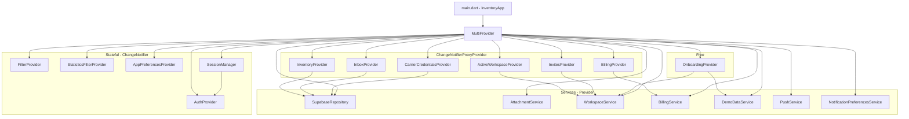

# 05 — Architektur

Dieses Kapitel beschreibt den **Stack** und die **Schichten** der App auf
Code-Ebene: wie die Provider zusammenhängen, wo Services leben, wie das
Theme funktioniert, wo Localization sitzt.

> Begriffe wie *Provider*, *ChangeNotifier*, *MultiProvider*, *RLS* sind im
> [Glossar](10-glossary.md) erklärt.

## Stack-Überblick

| Schicht | Technologie | Datei |
|---|---|---|
| UI | Flutter 3.11 (Dart `^3.11.5`) | `lib/screens/`, `lib/widgets/` |
| State | `provider` + `ChangeNotifier` | `lib/providers/` |
| Domain | Reines Dart, keine Widgets | `lib/services/`, `lib/models/` |
| Data | `supabase_flutter` 2.8 | `lib/services/supabase_repository.dart` |
| Backend | Supabase (Postgres + Auth + RLS) | `supabase/migrations/` |
| Server-Side-Code | Edge Functions (Deno + TypeScript) | `supabase/functions/` |
| Push | Firebase Messaging + `flutter_local_notifications` | `lib/services/push_service.dart` |
| Lokalisierung | `flutter_localizations` + ARB | `lib/l10n/` |
| Theme | Eigene Tokens in `app_theme.dart` | `lib/app_theme.dart` |
| Responsive | Zentrale Breakpoints + Zwei-Achsen-API | `lib/utils/responsive.dart` |

Wichtige Regel aus [CLAUDE.md](../../CLAUDE.md):

- **Kein Riverpod, GetX oder Bloc** — die App nutzt ausschließlich
  `provider`. Keine Mischformen.
- **Keine direkten Supabase-Calls aus Widgets** — immer über
  `SupabaseRepository` oder einen Service.
- **Theme-Tokens aus `AppTheme`** — keine `Colors.blue` ad hoc.

## Provider-DI-Tree



Erklärung:

- **Services** sind reine Dart-Klassen, die mit Supabase reden. Sie haben
  keinen UI-State und keinen Lifecycle.
- **Plain ChangeNotifier-Provider** halten App-weiten Zustand:
  `AuthProvider` (Session), `FilterProvider` (Deal-Filter),
  `StatisticsFilterProvider`, `AppPreferencesProvider` (Theme + Sprache).
- **Proxy-Provider** sind die Brücke: sie nehmen einen Service als Input
  und liefern einen ChangeNotifier-Provider raus, der den Service
  intern kapselt. Beispiel: `InventoryProvider(repository: ctx.read<SupabaseRepository>())`.
- **`SessionManager`** ist `lazy: false` und wird sofort gestartet — er
  registriert sich auf Pointer-Events und resetet einen Idle-Timer.

> Konkret nachzulesen in
> [`lib/main.dart`](../../lib/main.dart#L99-L176).

## Lifecycle: Login → Hydration → MainScreen

```text
       ┌─────────────────────────────────────────────┐
       │  user == null?                              │
       │  → LoginScreen + clear() aller Provider     │
       └────────────────┬────────────────────────────┘
                        │ user != null
                        ▼
       ┌─────────────────────────────────────────────┐
       │  _hydratedFor != user.id?                   │
       │  → SplashScreen + _hydrate(user.id)         │
       │      • workspaces.loadForCurrentUser()      │
       │      • inventory.setActiveWorkspace()       │
       │      • invites.refresh() + startPolling()   │
       │      • billing.load()                       │
       │      • applyPlanQuota → InboxProvider       │
       │      • push.registerCurrentDevice() (BG)    │
       └────────────────┬────────────────────────────┘
                        │ done
                        ▼
       ┌─────────────────────────────────────────────┐
       │  ws.onboardedAt == null && ws.ownerId==me?  │
       │  → OnboardingScreen                         │
       └────────────────┬────────────────────────────┘
                        │ onboarded
                        ▼
                    MainScreen
```

`AuthGate` aus [`main.dart`](../../lib/main.dart) orchestriert das. Sehr
wichtig: bei Sign-Out werden **alle** Provider geleert, sonst zeigt der
nächste Login Daten des Vor-Users (Datenleck). Siehe `_AuthGateState.build`
und der `if (user == null)`-Block.

## Provider-Verantwortlichkeiten

### `AuthProvider`

Datei: [`auth_provider.dart`](../../lib/providers/auth_provider.dart)

Hört auf Supabase-Auth-Events (`onAuthStateChange`). Methoden:

- `signIn`, `signUp`, `signOut`
- `signInWithGoogle`, `signInWithApple`
- `resetPasswordForEmail` + `passwordRecoveryStream` (für RecoveryListener)
- `currentUser` (Getter)

### `ActiveWorkspaceProvider`

Datei: [`active_workspace_provider.dart`](../../lib/providers/active_workspace_provider.dart)

Hält den **aktuell ausgewählten Workspace**. Methoden:

- `loadForCurrentUser(userId)` — alle Workspaces des Users laden, ersten als
  aktiv setzen.
- `presetActiveId(id)` — vor Auth setzen, damit Hydrator gleich richtig
  landet.
- `setActive(workspace)` — User wählt manuell.

Listener im `_AuthGate` triggern bei Wechsel:

- `InventoryProvider.setActiveWorkspace(newId)`
- `CarrierCredentialsProvider.refresh()`

### `InventoryProvider`

Datei: [`inventory_provider.dart`](../../lib/providers/inventory_provider.dart)

Der mit Abstand größte Provider (seit Epic Warenwirtschaft-Feature-Parity
deutlich über 880 LoC). Hält jetzt den gesamten Warenwirtschafts-State:

**Bestehende Listen (unverändert):**
`deals`, `buyers`, `shops`, `suppliers`, `inventoryItems`,
`inventoryMovements`, `activities`, `tickets`.

**Neu (Warenwirtschaft-Feature-Parity, Epic A–E):**
- `productCategories` — Warengruppen (`product_categories`)
- `products` — Artikelstamm (`products`)
- `productStock` — Aggregierter Bestand (`product_stock`-View)
- `purchaseOrders` + `purchaseOrderItems` — Bestellungen
- `warehouses` — Lagerorte
- `stocktakes` + `stocktake_items` — Inventur-Sessions

**Neue CRUD-Methoden (Auswahl):**
- Kategorien: `addProductCategory`, `updateProductCategory`,
  `deleteProductCategory`
- Produkte: `addProduct`, `updateProduct`, `deleteProduct`
- Bestellungen: `addPurchaseOrder`, `updatePurchaseOrder`,
  `bookGoodsReceipt(orderId, items)` — ruft RPC
  `increment_po_item_received` auf
- Lager: `addWarehouse`, `updateWarehouse`, `deleteWarehouse`
- Inventur: `addStocktake`, `updateStocktake`, `closeStocktake`,
  `updateStocktakeItem`

**KPI-Erweiterungen:**
`totalProductCount`, `lowStockProductCount` (über `product_stock`-View),
`totalWarehouseCount`.

Caches `loadAll()`-Snapshot pro Workspace. Optimistic-Update-Methoden
für jede CRUD-Aktion. CSV-Import/Export-Glue (`importCsvAll`).

**Delayed-Commit-Pattern / Undo-Delete (PR #109):**

`deleteDealWithUndo(int id, {Duration delay})` ersetzt direktes
`deleteDeal`. Ablauf:

1. Deal-ID wird in `_pendingDeleteIds` eingetragen — der `deals`-Getter
   filtert diese IDs sofort heraus (optimistisches Ausblenden).
2. Ein `Timer` auf `_pendingDeleteTimers` startet den Countdown (Default
   4 Sekunden).
3. Während des Countdowns kann der Caller `cancelPendingDelete(id)` rufen
   — Timer wird gecancelt, ID aus der Set entfernt, Deal erscheint sofort
   wieder in der Liste (Undo, kein DB-Touch).
4. Nach Timer-Ablauf führt `_commitPendingDelete(id)` den tatsächlichen
   `repository.deleteDeal(id)` aus.

Bei `dispose()` werden alle laufenden Timers gecancelt, damit keine
fire-and-forget Calls auf einem entsorgten Provider landen.

**`initialLoadAttempted`-Flag (Cold-Start-Skeleton-Race-Fix, PR #109):**

Wird nach dem ersten Rückkehren von `loadData()` auf `true` gesetzt
(auch bei Fehler). Der Getter ermöglicht `shouldShowSkeleton()` im
`list_skeleton.dart`, zwischen Cold-Start-Race (Provider noch nicht
gefeuert → Skeleton zeigen) und echtem Leer-Zustand nach abgeschlossener
Ladung (→ EmptyState zeigen) zu unterscheiden. Wird bei `clear()` auf
`false` zurückgesetzt.

### `InboxProvider`

Datei: [`inbox_provider.dart`](../../lib/providers/inbox_provider.dart)

Hält Inbox-State (≈730 LoC):

- `parsedMessages`, `pendingDealSuggestions`, `mailboxAccounts`.
- `applyPlanQuota({mailboxLimit, visibilityDays})` — vom AuthGate gerufen,
  basierend auf `BillingProvider.currentPlan`.
- Methoden: `pollNow()`, `reparseUnclassified()`, `dismiss()`,
  `acceptSuggestion()`, `markAllRead()`.

**Delayed-Reject / Optimistic-Undo (PR #109):**

`rejectSuggestionWithUndo(String suggestionId, {Duration delay})` implementiert
dasselbe Delayed-Commit-Pattern wie `InventoryProvider.deleteDealWithUndo`:

1. ID wird in `_pendingRejectIds` eingetragen — der `pendingSuggestions`-Getter
   filtert sie sofort aus der UI (optimistisches Ausblenden).
2. Timer startet den Countdown (Default 4 Sekunden) auf `_pendingRejectTimers`.
3. `cancelPendingReject(id)` bricht den Timer ab und macht die Suggestion
   sofort wieder sichtbar (Undo, kein DB-Touch).
4. Nach Timer-Ablauf ruft der Timer `markSuggestionRejected(id)` auf.
   Bei Fehler wird der Marker trotzdem entfernt, damit die Suggestion
   wieder erscheint (User kann es erneut versuchen).

**`initialLoadAttempted`-Flag (Cold-Start-Skeleton-Race-Fix, PR #109):**

Identisch zum `InventoryProvider`-Flag: gesetzt nach dem ersten Rückkehren
von `refresh()` (auch bei Fehler), wird bei `clear()` zurückgesetzt.
Ermöglicht `shouldShowSkeleton()` die Race-Condition zwischen Cold-Start
und leerem Ergebnis zu unterscheiden.

**Optimistic-Restore für Dismissals:**

`clearDismissalsOptimistic()` leert `_dismissalKeys` sofort lokal und
gibt einen Snapshot zurück. `restoreDismissals(keys, count)` stellt den
Snapshot wieder her (Undo). Der DB-DELETE-Call (`clearDismissals`) wird
erst nach Ablauf der SnackBar-Duration ausgeführt — kein DB-Touch bei
Undo.

### `BillingProvider`

Datei: [`billing_provider.dart`](../../lib/providers/billing_provider.dart)

`BillingService.load()` lädt das aktuelle Plan-Level (`Free` / `Starter` /
`Pro` / `Ultimate`) aus `billing_profiles`. UI-Code prüft
`PricingPlan.forBillingPlan(billing.currentPlan).hasInbox` o.ä.

### `FilterProvider` / `StatisticsFilterProvider`

Filter-Werte für Deals und Statistiken. Werden zwischen Tab-Wechseln
gehalten — UX-Detail, dass die Filter nicht jedes Mal weg sind.

### `AppPreferencesProvider`

Theme (`light`/`dark`/`system`) und Locale (`de`/`en`). Persistiert in
`SharedPreferences`.

### `SessionManager`

Eigene Klasse (kein ChangeNotifier-Provider, sondern simpler Provider).
Startet einen Idle-Timer (Default 30 Min). Bei Inaktivität:
`expiryWarningStream`-Event → `_ActivityListener` zeigt einen Banner.
`extendSession()` refresht das JWT.

### `OnboardingProvider`

Steuert den Onboarding-Stepper. `WorkspaceService.markOnboarded()` setzt am
Ende `workspaces.onboarded_at = NOW()`.

## Service-Schicht

Services sind **stateless** (oder halten nur den `SupabaseClient`). Pro
Domain genau einer:

- `SupabaseRepository` — alle Daten-CRUD-Operationen.
- `AttachmentService` — File-Uploads zu Supabase-Storage (Quittungen).
- `WorkspaceService` — Workspaces + Members + Invites + Backend-Trigger
  (`accept_invite`-RPC).
- `BillingService` — Plan-Status + Stripe-Webhook-Bezüge (Pre-Launch:
  Stripe noch nicht aktiv).
- `DemoDataService` — Edge-Function-Aufruf `seed-demo-workspace`.
- `PushService` — Firebase Messaging + Local Notifications.
- `NotificationPreferencesService` — User-Prefs aus `notification_preferences`.
- `CsvService` — Import/Export (alle Datentypen in einem ZIP).
- `StatisticsService` / `StatisticsExportService` — Berechnungen + PDF/CSV.
- `PurchaseOrderPdfService` — PDF-Generierung für Einkaufsbestellungen
  (Supabase-Storage-Upload + Sharing via `share_plus`).
- `InboxMatchService` — Helper, der einen `ParsedMessage` an einen Deal
  matcht (Plus/Minus Confidence). Seit Plan
  [`2026-05-13_strict_tracking_extraction.md`](../../plans/2026-05-13_strict_tracking_extraction.md)
  prüft `shouldWriteTracking` sechs Cases: Strong-Detect überschreibt
  bestehende Werte nur, wenn das alte Feld leer oder
  `tracking_needs_review = TRUE` ist; `'manual'`-Einträge bleiben
  unangetastet. Siehe
  [04 — Inbox-Pipeline](04-inbox-mail-pipeline.md#forward-only-schreib-regel-dart).
- `CarrierService` — UI-seitiger Helper für Tracking-Lookups.
- `SessionManager` — Idle-Tracking.

## Modelle

Pro Tabelle ein Modell in `lib/models/`. Konstruktoren:

**Neue Modelle (Warenwirtschaft-Feature-Parity):**

| Datei | Klasse | Tabelle |
|---|---|---|
| `product_category.dart` | `ProductCategory` | `product_categories` |
| `product.dart` | `Product` | `products` |
| `product_stock.dart` | `ProductStock` | `product_stock` (View) |
| `product_supplier.dart` | `ProductSupplier` | `product_suppliers` |
| `purchase_order.dart` | `PurchaseOrder` | `purchase_orders` |
| `purchase_order_item.dart` | `PurchaseOrderItem` | `purchase_order_items` |
| `warehouse.dart` | `Warehouse` | `warehouses` |
| `stocktake.dart` | `Stocktake` | `stocktakes` |
| `stocktake_item.dart` | `StocktakeItem` | `stocktake_items` |

`InventoryMovement` erhält zwei neue Felder: `movementType` (typisierter
Enum-Wert — `goods_in | goods_out | correction | stocktake | transfer |
sale`) und `unitCost` (nullable `double`).

`Supplier` erhält die 9 neuen Kreditoren-Felder (alle nullable):
`addressStreet`, `addressZip`, `addressCity`, `addressCountry`, `vatId`,
`customerNumber`, `paymentTermsDays`, `leadTimeDays`, `minOrderValue`.

> Ergänzend zu den Tabellen-Modellen lebt in
> [`lib/models/tracking_confidence.dart`](../../lib/models/tracking_confidence.dart)
> das Enum `TrackingConfidence` (`strong | manual | none`), das von
> `Deal`, `InboxMessage` und dem Widget
> [`lib/widgets/tracking_status_block.dart`](../../lib/widgets/tracking_status_block.dart)
> (5 Display-States) gemeinsam genutzt wird. Hintergrund siehe
> [04 — Inbox-Pipeline](04-inbox-mail-pipeline.md#strict-tracking-extraction-confidence-modell).


- `Model.fromMap(Map<String, dynamic>)` — von Supabase-Row.
- `Model.toMap()` — für INSERT/UPDATE.
- `copyWith({…})` — immer dabei, weil Provider-Updates immutable.

Sehr typisches Pattern (gekürzt):

```dart
class Deal {
  final int id;
  final String product;
  final String status;
  // …
  Deal.fromMap(Map<String, dynamic> m)
      : id = m['id'] as int,
        product = m['product'] as String,
        status = m['status'] as String;
  Deal copyWith({String? status, …}) => Deal(/* … */);
}
```

## Theme

Datei: [`lib/app_theme.dart`](../../lib/app_theme.dart)

Tokens:

- `AppTheme.bgApp`, `AppTheme.bgCard`, `AppTheme.navBg`
- `AppTheme.accent`, `AppTheme.success`, `AppTheme.danger`, `AppTheme.warning`
- `AppTheme.textPrimary`, `AppTheme.textSecondary`
- `AppTheme.warningBgOf(context)` / `warningTextOf(context)` — kontextsensitive
  Variante (Dark/Light).

`AppTheme.light` und `AppTheme.dark` sind die `ThemeData`-Instanzen, die
`MaterialApp` bekommt. Schriftarten kommen über `google_fonts`.

> Regel: Wenn dir ein neuer Farbwert fehlt, **leg ihn als Token in
> `AppTheme` an**, nicht als ad-hoc-`Color`. Sonst zerlegt sich Dark-Mode
> bei der nächsten Erweiterung.

### Akzent-Paletten (PR #68)

Seit Mai 2026 wählt der User zwischen fünf Akzent-Paletten (`blue`,
`indigo`, `violet`, `teal`, `rose`). Persistenz via
[`AppPreferencesProvider`](../../lib/providers/app_preferences_provider.dart)
in `SharedPreferences`. UI-Picker im
[Settings-Screen](03-screens-walkthrough.md#settings).

Konsequenz für Caller-Code: `AppTheme.accent`, `AppTheme.accentBg`,
`AppTheme.accentBorder` u.a. sind **runtime-getter** (lesen die aktive
Palette aus dem `AppTheme`-Singleton), nicht `static const Color`.
Verwendung in `const`-Kontexten (`const Icon(...)`, `const BoxDecoration(...)`)
führt zu Compile-Errors — siehe Folge-Commit zu PR #68, der 13 Call-Sites
auf `final` umgestellt hat.

Dark-Mode-Refactor (PR #73): `pricing_screen.dart` + `billing_profile_screen.dart`
nutzen jetzt durchgängig `AppTheme.bgSurfaceOf(context)`,
`AppTheme.textMutedOf(context)` etc. statt hardcoded `Colors.black54` /
`Colors.white`. Brand-pinned `Colors.white` (Foreground auf Accent-
Buttons) und ultra-low-alpha Shadows bleiben.

### Visual-Tokens: AppSpacing / AppRadius / AppElevation (PR #109)

Drei ergänzende Klassen in `app_theme.dart` bieten semantische Aliasnamen
für konsistentes Spacing, Border-Radii und Elevations:

```dart
AppSpacing.xs  = 4   AppSpacing.sm = 8   AppSpacing.md = 12
AppSpacing.lg  = 16  AppSpacing.xl = 24  AppSpacing.xxl = 32
AppSpacing.xxxl = 48

AppRadius.sm = 6   (Chips)
AppRadius.md = 8   (Cards — Default)
AppRadius.lg = 12  (Dialoge, FAB)
AppRadius.xl = 16
AppRadius.pill = 999  (Badges / Tags)

AppElevation.card = 1   AppElevation.dialog = 8   AppElevation.fab = 6
```

Grundlage sind `AppTheme.space*`- und `AppTheme.radius*`-Konstanten
(alle `static const double`), die ebenfalls in PR #109 zu `AppTheme`
hinzugefügt wurden. Neue Screens sollen `AppSpacing`/`AppRadius`/
`AppElevation` bevorzugen — Magic-Number-Abstände in `lib/` sind
Anti-Pattern (gleiche Logik wie bei `Breakpoints.*`).

## Localization

Datei: [`lib/l10n/`](../../lib/l10n/)

- `app_de.arb` und `app_en.arb` enthalten die Strings.
- `flutter gen-l10n` generiert daraus
  `app_localizations.dart` + `_de.dart` / `_en.dart`.
- `MaterialApp.localizationsDelegates` umfasst:
  `AppLocalizations.delegate` plus die Material/Widgets/Cupertino-Defaults.
- Zugriff: `AppLocalizations.of(context).<key>`.

> Regel: **Jeder UI-sichtbare Text** muss in beiden ARBs stehen. Hardcoded
> deutsche Strings sind ein Lint-Fehler in PRs.

## Routing

Es gibt **kein** klassisches Named-Routing. Die App nutzt:

- `MaterialApp.home` mit dem `_AuthGate`-Wrapper.
- `MainScreen` mit Index-State für Top-Level-Tabs.
- Ad-hoc `Navigator.push(MaterialPageRoute(...))` für Detail-Screens.
- `RecoveryListener` pusht den `ResetPasswordScreen` über den Root-Navigator.

Web-only-Sonderfall: `publicProfileHandleFromUri(Uri.base)` parst
`/u/<handle>` aus der aktuellen Browser-URL und rendert
`PublicProfileScreen` ohne Login.

## Web vs. Mobile

- **Mobile** (iOS/Android) ist Primärziel. Bottom-Navigation auf
  `width < 600` (= `Breakpoints.phone`), Sidebar/NavigationRail auf Desktop.
- **Web** läuft auf Chrome (Smoke-Tests, Public-Profile, Admin-Tools).
- Plattform-Switch nicht über `Platform.is*`, sondern `kIsWeb` und
  `MediaQuery.sizeOf(context)`.

## Responsive-Utility

Datei: [`lib/utils/responsive.dart`](../../lib/utils/responsive.dart)

Zentrale Breakpoint-Infrastruktur, eingeführt in Epic 1 des
[Responsive-Overhaul-Plans](../../plans/2026-05-22_ui-ux-responsive-overhaul.md).
Ersetzt app-weite Magic-Number-Breakpoints durch eine einzige Quelle.

### Zwei-Achsen-API

Das Herzstück sind **zwei bewusst getrennte Achsen**, um den
Viewport-vs-Container-Bug zu verhindern (ein Detail-Panel, das auf
1440-px-Viewport erscheint, obwohl die 220-px-Sidebar den nutzbaren
Container auf 1220 px reduziert hat):

**Achse 1 — Viewport (nur `main_screen.dart`)**

Kapselt `MediaQuery.sizeOf(context)` und liefert die Breite des gesamten
App-Fensters. Darf **ausschließlich in `main_screen.dart`** für den
Shell-Switch (Bottom-Nav vs. NavigationRail) benutzt werden — überall sonst
ist der Viewport die falsche Größe.

```dart
ScreenSize screenSizeOf(BuildContext context)  // → ScreenSize-Enum
bool isPhoneViewport(BuildContext context)      // < 600 px
bool isDesktopViewport(BuildContext context)    // ≥ 900 px
```

**Achse 2 — Container (für alle LayoutBuilder-Stellen)**

Pure Funktionen auf `double` — nehmen **keinen** `BuildContext`. Werden mit
`constraints.maxWidth` aus einem `LayoutBuilder` aufgerufen. Das fehlende
`BuildContext`-Argument macht es strukturell unmöglich, versehentlich die
Viewport-Breite zu übergeben.

```dart
WidthClass widthClassOf(double width)   // → WidthClass-Enum
bool isCompact(double width)            // < 600
bool isMedium(double width)             // 600–899
bool isExpanded(double width)           // 900–1199
bool isLarge(double width)             // ≥ 1200  → Master-Detail-Schwelle
```

Typische Verwendung im Screen-Layout:

```dart
LayoutBuilder(
  builder: (context, constraints) {
    return isLarge(constraints.maxWidth)
        ? const _MasterDetailLayout()
        : const _SingleColumnLayout();
  },
)
```

### Breakpoints

| Konstante | Wert | Bedeutung |
|---|---|---|
| `Breakpoints.phone` | 600 px | Phone/nicht-Phone — CLAUDE.md-konform |
| `Breakpoints.navRail` | 900 px | Shell-Switch Bottom-Nav→NavigationRail |
| `Breakpoints.master` | 1200 px | Master-Detail-Split, Rail-Extended |
| `Breakpoints.railExtended` | 1200 px | Alias für `master` — Labels sichtbar |

Bewusste Abweichung von Material-3-Standard (840 px): bei 840 px Viewport
und 220 px Sidebar verbleiben nur ~620 px Body — zu eng für einen
komfortablen zwei-spaltigen Split.

### Migration (Phase A / Phase B)

Alle bestehenden Magic-Number-Breakpoints werden zweiphasig migriert:

- **Phase A** — Wert identisch, nur `Breakpoints.legacyXxx`-Konstante statt
  Zahl. Verhaltensneutral, pixel-identischer Audit.
- **Phase B** — Wert ändert sich, Verhaltens-Diff explizit dokumentiert. Die
  `legacy*`-Konstanten werden nach dem Cleanup entfernt.

`@deprecated`-Annotationen in `responsive.dart` markieren alle noch
ausstehenden Phase-B-Werte.

### Constraint-vs-Viewport-Bug

Vor dem Overhaul nutzte u. a. `deals_screen.dart:17`
`MediaQuery.of(context).size.width` für einen Screen-internen Split-Check —
obwohl der Screen-Body neben der 220-px-Sidebar lag. Das Ergebnis: Die
Viewport-Breite (z. B. 1280 px) überstieg die Schwelle, der Container (1060
px) aber nicht. Die Zwei-Achsen-API macht diese Fehlklasse strukturell
unmöglich.

## AppScreenScaffold

Datei: [`lib/widgets/app_screen_scaffold.dart`](../../lib/widgets/app_screen_scaffold.dart)

Gemeinsames Scaffold-Wrapper-Widget, verbindlich für alle Screens
(eingeführt in Epic 3). Löst das Problem „Desktop = gestreckte Phone-Säule",
indem es den Body auf Desktop horizontal zentriert und auf `maxContentWidth`
begrenzt (Default 1200 px).

**Layout-Verhalten:**

| Container-Breite | Verhalten |
|---|---|
| `< Breakpoints.phone` (Phone) | Body füllt volle Breite |
| `≥ Breakpoints.phone` (Tablet/Desktop) | Body zentriert, max `maxContentWidth` |

Die Breitenklasse wird via `widthClassOf(constraints.maxWidth)` aus einem
internen `LayoutBuilder` bestimmt — nie `MediaQuery`.

**Slots:**

```dart
AppScreenScaffold(
  appBar: AppBar(...),              // optional — null bei embedded-Screens
  floatingActionButton: ...,        // optional, direkt an Scaffold
  header: SearchBar(...),           // optional Sub-Header unter AppBar
  isEmpty: items.isEmpty,           // true → zeigt emptyState statt body
  emptyState: EmptyState(...),      // optional, nur wenn isEmpty true
  body: _MyList(),                  // Pflicht
  maxContentWidth: 1200,            // default
)
```

`SafeArea` liegt um den gesamten Scroll-Bereich — schützt vor Notch und
Home-Indicator. A11y-Key `Key('appScreenContent')` auf dem Content-Container.

## EmptyState

Datei: [`lib/widgets/empty_state.dart`](../../lib/widgets/empty_state.dart)

Einheitliches Empty-State-Widget. Ersetzt die diversen lokalen
`_EmptyStateCard`- und `_EmptyState`-Widgets, die in jedem Screen separat
existierten (Migration läuft in Epic 4, Task T4.2 — noch nicht alle
Screens umgestellt).

```dart
EmptyState(
  icon: Icons.category_outlined,
  title: l10n.categoriesEmpty,
  subtitle: l10n.categoriesEmptyHint,
  action: ElevatedButton(            // optional CTA
    onPressed: _openAddDialog,
    child: Text(l10n.categoryNew),
  ),
  keySlug: 'categories',             // → Key('emptyState-categories')
)
```

Alle sichtbaren Strings kommen vom Caller via l10n — das Widget hardcodet
keine deutschen Texte.

## Modal-Layer-Widgets (PR #109)

Vier neue querschnittliche Widgets standardisieren Feedback, Bestätigung,
Formularsicherung und Lade-Zustände app-weit. Sie ersetzen lokale
Inline-Lösungen (je nach Screen ad-hoc gebaut) durch eine einheitliche API.

### `AppFeedback`

Datei: [`lib/widgets/app_feedback.dart`](../../lib/widgets/app_feedback.dart)

Abstrakter Helper mit statischen Methoden für konsistente SnackBars.
Keine eigene Widget-Klasse — ausschließlich statische Methoden.

| Methode | Variante | Farbe |
|---|---|---|
| `AppFeedback.success(context, msg, {onUndo})` | Context | `AppTheme.successBgOf` |
| `AppFeedback.error(context, msg)` | Context | `AppTheme.dangerBgOf` |
| `AppFeedback.info(context, msg)` | Context | `AppTheme.infoBgOf` |
| `AppFeedback.successOn(messenger, msg, {rootContext, onUndo})` | Messenger | wie oben |
| `AppFeedback.errorOn(messenger, msg, {rootContext})` | Messenger | wie oben |
| `AppFeedback.infoOn(messenger, msg, {rootContext})` | Messenger | wie oben |

**Phone-Bottom-Margin:** SnackBar liegt über der Bottom-Navigation
(`kBottomNavHeight = 80 dp` + SafeArea-Bottom-Inset + 8 dp). Auf
Desktop/Tablet 16 dp. Basis: `MediaQuery.sizeOf(context).width < Breakpoints.phone`.

**Dialog-Context-Pattern:** Wenn `AppFeedback` aus einem Dialog heraus
aufgerufen wird, muss der `ScaffoldMessengerState` VOR dem Dialog-Öffnen
gecaptured werden (`final messenger = ScaffoldMessenger.of(context)`),
weil nach dem Dialog-Close der Dialog-Kontext abgeräumt ist. Dann
`AppFeedback.successOn(messenger, msg, rootContext: context)` nutzen.

**Undo-Slot:** `success()` und `successOn()` akzeptieren einen
`onUndo`-Callback. Ist er gesetzt, erscheint eine „Rückgängig"-Action
mit `Key('appFeedbackUndoAction')` in der SnackBar.

### `ConfirmDialog` / `showConfirmDialog`

Datei: [`lib/widgets/confirm_dialog.dart`](../../lib/widgets/confirm_dialog.dart)

Responsive Bestätigungs-Dialog-Funktion:

- **Phone** (Viewport-Breite `< Breakpoints.phone`): `showModalBottomSheet`
  mit `isScrollControlled: true` + `MediaQuery.viewInsetsOf` für
  Keyboard-Inset. Breite Buttons (Touch-Target ≥ 48 dp).
- **Desktop**: zentrierter `AlertDialog`.

Parameter:

```dart
Future<bool> showConfirmDialog({
  required BuildContext context,
  required String title,
  required String message,
  required String confirmLabel,
  String? cancelLabel,
  bool isDestructive = false,   // danger-Styling + HapticFeedback
  String? requireTypeName,      // User muss diesen String exakt eintippen
})
```

`requireTypeName`: Confirm-Button bleibt disabled bis der User den
exakten String eingegeben hat. Bidi-Override-Chars (U+202A–U+202E,
U+2066–U+2069 etc.) werden vor dem Vergleich via `_sanitizeBidi()`
gefiltert (Defense-in-Depth gegen visuelle Spoofing-Angriffe).

`PopScope` liegt innerhalb des Dialog-Trees (Pflicht — sonst greift
`canPop: false` nicht in `showDialog`-Routes).

### `UnsavedChangesGuard`

Datei: [`lib/widgets/unsaved_changes_guard.dart`](../../lib/widgets/unsaved_changes_guard.dart)

`PopScope`-Wrapper für Dialog-/Form-Trees. Bei `isDirty: true` wird
Back-Button / Navigator.pop abgefangen und ein Discard-Confirm via
`showConfirmDialog` (destruktiv) angezeigt.

```dart
UnsavedChangesGuard(
  isDirty: _formKey.currentState?.isDirty ?? false,
  child: YourFormContent(),
)
```

**Wichtig:** Der Guard muss INNERHALB des Dialog-Trees liegen, nicht
um den `showDialog`-Call. Nur so greift `PopScope` auf die
Dialog-Route.

### `ListSkeleton` + `shouldShowSkeleton`

Datei: [`lib/widgets/skeletons/list_skeleton.dart`](../../lib/widgets/skeletons/list_skeleton.dart)

Zentrales Skeleton-Loading-Widget für Listen-Screens. Basiert auf dem
`skeletonizer`-Paket.

```dart
ListSkeleton({
  int itemCount = 6,        // IMMER fest — nie aus echten Daten ableiten
  double itemHeight = 88,
  Widget Function(BuildContext, int)? itemBuilder,
  EdgeInsetsGeometry padding = const EdgeInsets.all(16),
})
```

`Key('skeletonLoader')` auf dem Root — der Browser-Tester erkennt
damit den Lade-Zustand zuverlässig.

`shouldShowSkeleton({bool isLoading, bool hasData, bool initialLoadAttempted})`:
Pure Helper-Funktion, steuert Race-Condition-safe, wann der Skeleton
zu zeigen ist:

- `!initialLoadAttempted && !hasData` → Skeleton (Cold-Start-Race).
- `isLoading && !hasData` → Skeleton.
- Sonst → kein Skeleton (d.h. bei Refresh mit vorhandenen Daten bleibt
  der Content sichtbar — kein Layout-Jank).

Typische Verwendung mit `AnimatedSwitcher`:

```dart
AnimatedSwitcher(
  duration: const Duration(milliseconds: 200),
  child: shouldShowSkeleton(
    isLoading: provider.isLoading,
    hasData: provider.items.isNotEmpty,
    initialLoadAttempted: provider.initialLoadAttempted,
  )
      ? const ListSkeleton(key: ValueKey('skeleton'))
      : MyList(key: ValueKey('content')),
)
```

### `AppNavRail`

Datei: [`lib/widgets/app_nav_rail.dart`](../../lib/widgets/app_nav_rail.dart)

Ersetzt das frühere Custom-`_Sidebar`-Widget in `main_screen.dart`.
Wrapping-Widget um Flutter-`NavigationRail` mit Branding-Header
(Logo + optionale Wordmark), Plan-Gating über eine `visibility`-Map
und Index-Mapping `MainTab ↔ RailIndex`.

**API-Besonderheiten:**
- Callback liefert `MainTab` (Enum), nicht den int-Index der Rail.
  Intern geschieht das Mapping `visible.indexOf(selectedTab)` →
  `visibleTabAtRailIndex` → `MainTab`.
- `extended: true` + `labelType: null` (Labels neben Icons); bei
  `extended: false` → `labelType: NavigationRailLabelType.none` (Assertion-Fix).
- `scrollable: true` (Flutter SDK ≥ 3.27) für 11 Tabs auf kleinen
  Viewport-Höhen.
- A11y-Keys: `Key('mainNavRail')` auf Root,
  `Key('navRailDestination-<tab.name>')` pro Destination.

## Master-Detail-Pattern

Eingeführt in Epic 3 (Tasks T3.3, T3.4) als Standard für Listen-Screens auf
Desktop. Phone-Verhalten bleibt in allen Fällen **unverändert**.

### Implementierungen

Zwei Screens nutzen das Muster:

**Inventory (`lib/screens/inventory_screen.dart`):**

- Desktop (`isLarge(constraints.maxWidth)` = `≥ 1200 px`): Liste links
  (~360 px), `ProductDetailScreen` rechts als embedded Sub-Screen in einem
  `Expanded`. Item-Tap setzt `_selectedItemId` — kein `Navigator.push`.
- Phone: Tap pusht `ProductDetailScreen` als Vollbild-Route (alter Pfad
  unverändert).
- Die Detail-Spalte lebt **über beiden TabBar-Tabs** (Stock/Sold). Beim
  Tab-Wechsel wird die Selektion zurückgesetzt, da Stock- und Sold-Items
  verschiedene Pools sind.

**Warehouse-Hub (`lib/screens/warehouse_hub_screen.dart`):**

- Desktop (`isExpanded || isLarge`, ≥ 900 px): Kacheln links (280–360 px),
  gewählter Sub-Bereich rechts als embedded Sub-Screen. `WarehouseTile`-Enum
  steuert die Auswahl via `_selectedTile`.
- Phone: Kachel-Tap pusht Vollbild (unverändert).
- **Reporting-Tile-Ausnahme:** das Reporting-Tile pusht auch auf Desktop
  Vollbild — `StatisticsScreen` ist heute nicht embeddable (eigener Sub-Task
  offen). Dokumentierter Trade-off.

### Embeddable-Pattern

Detail-Screens können eingebettet werden über den `embedded: bool`-Parameter:

```dart
ProductDetailScreen(itemId: id, embedded: true)
// → kein eigener Scaffold / AppBar im embedded-Modus
```

Dasselbe Pattern gilt für die fünf Warehouse-Hub-Sub-Screens
(`ProductCatalogScreen`, `PurchaseOrdersScreen`, `WarehousesScreen`,
`CategoriesScreen`, `StocktakeScreen`) — jeder prüft intern `embedded` und
überspringt Scaffold/AppBar wenn `true`.

### State-Lifting

`_selectedItemId` (Inventory) und `_selectedTile` (Warehouse-Hub) leben im
Parent-State **oberhalb** des `LayoutBuilder`-Switches. Beim Resize
Phone↔Desktop bleibt die Selektion erhalten — der `LayoutBuilder` switcht
nur das Layout, nicht den Zustand.

`PageStorageKey` auf den Master-Listen sichert Scroll- und Suchzustand beim
Resize.

### A11y-Keys für Master-Detail

| Key | Widget | Zweck |
|---|---|---|
| `Key('detailPane')` | Detail-Pane-Root | Browser-Tester-Anker |
| `Key('detailPaneEmpty')` | Empty-Placeholder | kein Item gewählt |
| `Key('hubTile<Name>')` | Hub-Kachel | Warehouse-Hub-Kacheln |

## Tests

Datei-Layout:

- `test/<service>_test.dart` — Unit-Tests für Services.
- `test/widgets/...` — Widget-Tests für komplexe Custom-Widgets.
- Provider mit gemockten Services testen — keine Live-Supabase-Verbindung
  in Unit-Tests.

Browser-Smoke-Tests laufen über das Playwright-MCP. Trigger:
`/test-ui smoke-login`, `/test-ui smoke-inbox`. Reports in
`.claude/test-runs/<timestamp>/`.

## CI / Auto-Merge

Branch-Protection auf `main` ist aktiv (siehe
[`.claude/scripts/setup-branch-protection.sh`](../../.claude/scripts/setup-branch-protection.sh)).
Pflicht-Checks:

- `flutter analyze`
- `flutter test`
- Security-Reviewer (lokal vor `/ship`)

`/ship` macht: Commit auf Feature-Branch → Push → PR via `gh` → Auto-Merge
(`gh pr merge --auto --squash --delete-branch`).

## Subagenten

Spezialisierte Agenten in [`.claude/agents/`](../../.claude/agents/), die
für Routine-Aufgaben gerufen werden — von `/ship`, vom Headless-Runner
oder direkt per Slash-Command:

| Agent | Aufgabe | Trigger |
|---|---|---|
| `planner` | Implementation-Pläne nach `plans/` | `/plan <feature>` |
| `flutter-coder` | Provider/Service/Model-Code in `lib/` | `work`-Skill, planner-Tasks |
| `ui-builder` | Screens/Widgets in `lib/screens/` + `lib/widgets/` | planner-Tasks mit UI-Scope |
| `db-migrator` | Supabase-Migrations + RLS | `/migrate`, planner-DB-Tasks |
| `edge-fn-coder` | Deno/TypeScript-Edge-Functions | planner-API-Tasks |
| `tester` | `flutter analyze` + `flutter test`, fixt Failures | nach Coder-Runs |
| `security-reviewer` | RLS/Secrets/OWASP-Review vor PR | `/ship`, manuell |
| `browser-tester` | Playwright-MCP-Smokes gegen Web-App | `/test-ui`, UI-Tasks |
| `l10n-checker` | ARB-Symmetrie + Hardcoded-Strings | `/check-l10n` |
| `doc-updater` | Hält `docs/handbook/` synchron mit Code-Änderungen | `/update-docs`, optional in `/ship` |
| `intake-skeptic` | Intake-Council: ROI-/Duplikat-/Maintenance-kritische Gegenstimme | `intake-council.sh` |
| `intake-pragmatist` | Intake-Council: Tie-Break zwischen Proponent + Skeptic (Opus) | `intake-council.sh` |
| `intake-validator` | Schema-Wall: validiert `pending-approval`-Files vor Backlog-Aufnahme | `intake-council.sh` |

Modell-Routing siehe [CLAUDE.md](../../CLAUDE.md): Plan/Architektur/RLS auf
Opus, Routine-Coding auf Sonnet.

## Autonomous Council Swarm

Vollständig autonomer Multi-Agent-Loop für unbeaufsichtigte Backlog-Abarbeitung. Implementiert in Phase 0-3 (PRs #52, #53, #54).

Kernkomponenten: **Stakeholder-Triage** (ntfy / Telegram → Backlog-Inbox), **Overseer-Daemon** (pick_next_item → Worktree → Worker), **Analyzer-Daemon** (stündliche Code-Scans → automatische Backlog-Items), **Watchdog + Recovery** (Disk, Cost-Cap, tote PIDs), **Briefing + Digest** (tägliche/wöchentliche Zusammenfassungen), **Heartbeat-Daemon** (10-Min-Activity-Aware-Pulse via ntfy).

### Heartbeat-Daemon (PRs #70, #71)

Skript [`.claude/scripts/heartbeat.sh`](../../.claude/scripts/heartbeat.sh)
+ LaunchAgent `com.inventory.heartbeat` (Install:
[`install-heartbeat.sh`](../../.claude/scripts/install-heartbeat.sh)).

- **Singleton-Lock** via Python `fcntl.flock` (`heartbeat.lock`,
  Inode-preserving Truncate beim Stop — verhindert Orphan-Inode-Bug
  bei dem zwei Instanzen gleichzeitig exclusive-flocken).
- **Activity-Detection** vor jedem Push: pusht nur, wenn ein aktiver
  Worker läuft, Items in `overseer/in_progress/`, wartende Inbox-Items,
  Recent Failures (< 30 min), Stakeholder-Pending oder ein PANIC-Marker
  präsent sind. Sonst silent-idle (nur Log-Zeile, kein ntfy).
- **`--stop`-Flag** beendet den Daemon kontrolliert (SIGTERM via Lock-
  PID, `pgrep`-Fallback gegen Strays, eigene PID/PPID ausgeschlossen).

Pattern identisch zu `telegram-bot.py` und `live-status`-Daemon.

Mensch-im-Loop-Stops (u. a. `supabase db push`, Cost-Cap, PANIC nach 3 Failures) sind hart in den Skripten verankert.

Vollständige Architektur, Setup-Befehle und alle 10 Human-in-the-Loop-Stops:
→ [CLAUDE.md § Autonomous Council Swarm](../../CLAUDE.md)
→ Plan: [`plans/2026-05-09_autonomous_council_swarm.md`](../../plans/2026-05-09_autonomous_council_swarm.md)

## Intake-Council (Post-Phase-4-Add-On)

User-Ideen durchlaufen seit Mai 2026 einen Council-Gate bevor sie ins Backlog wandern:

**Pfad:** Telegram/CLI `/yota propose` → 3-Agent-Mini-Council (Proponent + Intake-Skeptic + Intake-Pragmatist) → Verdict-Push an User → User-Approval → intake-validator → Backlog.

**Begründung:** Pre-Launch-ROI-Filter. Verhindert dass Worker-Capacity für nice-to-have-Features draufgeht.

**Details:** `CLAUDE.md` § Autonomous Council Swarm → Intake-Council. Plan: `plans/2026-05-12_yota-council-gated-intake.md`.

**Re-Use vs. Neu:**
- Re-Use: `disput-proponent` (mit Intake-Mode-Header), `cost-cap.sh`, `audit.sh`, `notify.sh`, Sandwich-Marker-Pattern.
- Neu: `intake-skeptic.md`, `intake-pragmatist.md`, `intake-validator.md` (alle nicht in Self-Mod-Blocklist).

## Anti-Patterns (NICHT machen)

- Riverpod / GetX neben Provider mischen.
- Direkte `Supabase.instance.client.from(...)`-Calls aus Widgets.
- `Colors.blue` / Hex-Werte in `lib/screens/` oder `lib/widgets/`.
- Hardcoded `'Profil bearbeiten'` o.ä. (muss in ARB).
- `Platform.isIOS`-Branches im UI-Code.
- `git add .` (siehe Whitelist in CLAUDE.md).
- `MediaQuery.sizeOf(context)` für Screen-interne Layout-Entscheidungen —
  stattdessen `widthClassOf(constraints.maxWidth)` aus einem `LayoutBuilder`
  (Viewport-vs-Container-Bug, siehe [Responsive-Utility](#responsive-utility)).
- Hardcoded Magic-Number-Breakpoints in neuen Screens — immer `Breakpoints.*`
  aus `lib/utils/responsive.dart` verwenden.

## Quelle im Code

- [`lib/main.dart`](../../lib/main.dart) — Bootstrapping + Provider-Tree
- [`lib/app_theme.dart`](../../lib/app_theme.dart) — Theme-Tokens
- [`lib/l10n/app_de.arb`](../../lib/l10n/app_de.arb) — Deutsche Strings
- [`lib/l10n/app_en.arb`](../../lib/l10n/app_en.arb) — Englische Strings
- [`lib/providers/`](../../lib/providers/) — Alle Provider
- [`lib/services/`](../../lib/services/) — Alle Services
- [`lib/models/`](../../lib/models/) — Domain-Modelle
- [`lib/utils/responsive.dart`](../../lib/utils/responsive.dart) — Responsive-Utility (Zwei-Achsen-API)
- [`lib/widgets/app_screen_scaffold.dart`](../../lib/widgets/app_screen_scaffold.dart) — Gemeinsames Screen-Scaffold
- [`lib/widgets/empty_state.dart`](../../lib/widgets/empty_state.dart) — Gemeinsames Empty-State-Widget
- [`lib/widgets/app_feedback.dart`](../../lib/widgets/app_feedback.dart) — Zentraler SnackBar-Helper
- [`lib/widgets/confirm_dialog.dart`](../../lib/widgets/confirm_dialog.dart) — Responsiver Bestätigungs-Dialog
- [`lib/widgets/unsaved_changes_guard.dart`](../../lib/widgets/unsaved_changes_guard.dart) — Formularsicherungs-Wrapper
- [`lib/widgets/skeletons/list_skeleton.dart`](../../lib/widgets/skeletons/list_skeleton.dart) — Skeleton-Loading für Listen
- [`lib/widgets/app_nav_rail.dart`](../../lib/widgets/app_nav_rail.dart) — Desktop-NavigationRail
- [`lib/utils/error_messages.dart`](../../lib/utils/error_messages.dart) — `sanitizeError()`-Hilfsfunktion
- [`lib/services/supabase_repository.dart`](../../lib/services/supabase_repository.dart) — Single-Point-of-Contact zum Backend
- [`pubspec.yaml`](../../pubspec.yaml) — Dependencies
- [`analysis_options.yaml`](../../analysis_options.yaml) — Lint-Regeln
- [Glossar](10-glossary.md) — Begriffsdefinitionen
