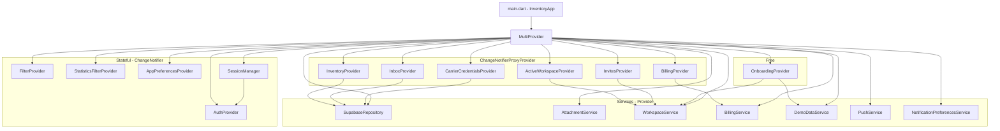

# 05 — Architektur

Dieses Kapitel beschreibt den **Stack** und die **Schichten** der App auf
Code-Ebene: wie die Provider zusammenhängen, wo Services leben, wie das
Theme funktioniert, wo Localization sitzt.

> Begriffe wie *Provider*, *ChangeNotifier*, *MultiProvider*, *RLS* sind im
> [Glossar](10-glossary.md) erklärt.

## Stack-Überblick

| Schicht | Technologie | Datei |
|---|---|---|
| UI | Flutter 3.11 (Dart `^3.11.5`) | `lib/screens/`, `lib/widgets/` |
| State | `provider` + `ChangeNotifier` | `lib/providers/` |
| Domain | Reines Dart, keine Widgets | `lib/services/`, `lib/models/` |
| Data | `supabase_flutter` 2.8 | `lib/services/supabase_repository.dart` |
| Backend | Supabase (Postgres + Auth + RLS) | `supabase/migrations/` |
| Server-Side-Code | Edge Functions (Deno + TypeScript) | `supabase/functions/` |
| Push | Firebase Messaging + `flutter_local_notifications` | `lib/services/push_service.dart` |
| Lokalisierung | `flutter_localizations` + ARB | `lib/l10n/` |
| Theme | Eigene Tokens in `app_theme.dart` | `lib/app_theme.dart` |

Wichtige Regel aus [CLAUDE.md](../../CLAUDE.md):

- **Kein Riverpod, GetX oder Bloc** — die App nutzt ausschließlich
  `provider`. Keine Mischformen.
- **Keine direkten Supabase-Calls aus Widgets** — immer über
  `SupabaseRepository` oder einen Service.
- **Theme-Tokens aus `AppTheme`** — keine `Colors.blue` ad hoc.

## Provider-DI-Tree



Erklärung:

- **Services** sind reine Dart-Klassen, die mit Supabase reden. Sie haben
  keinen UI-State und keinen Lifecycle.
- **Plain ChangeNotifier-Provider** halten App-weiten Zustand:
  `AuthProvider` (Session), `FilterProvider` (Deal-Filter),
  `StatisticsFilterProvider`, `AppPreferencesProvider` (Theme + Sprache).
- **Proxy-Provider** sind die Brücke: sie nehmen einen Service als Input
  und liefern einen ChangeNotifier-Provider raus, der den Service
  intern kapselt. Beispiel: `InventoryProvider(repository: ctx.read<SupabaseRepository>())`.
- **`SessionManager`** ist `lazy: false` und wird sofort gestartet — er
  registriert sich auf Pointer-Events und resetet einen Idle-Timer.

> Konkret nachzulesen in
> [`lib/main.dart`](../../lib/main.dart#L99-L176).

## Lifecycle: Login → Hydration → MainScreen

```text
       ┌─────────────────────────────────────────────┐
       │  user == null?                              │
       │  → LoginScreen + clear() aller Provider     │
       └────────────────┬────────────────────────────┘
                        │ user != null
                        ▼
       ┌─────────────────────────────────────────────┐
       │  _hydratedFor != user.id?                   │
       │  → SplashScreen + _hydrate(user.id)         │
       │      • workspaces.loadForCurrentUser()      │
       │      • inventory.setActiveWorkspace()       │
       │      • invites.refresh() + startPolling()   │
       │      • billing.load()                       │
       │      • applyPlanQuota → InboxProvider       │
       │      • push.registerCurrentDevice() (BG)    │
       └────────────────┬────────────────────────────┘
                        │ done
                        ▼
       ┌─────────────────────────────────────────────┐
       │  ws.onboardedAt == null && ws.ownerId==me?  │
       │  → OnboardingScreen                         │
       └────────────────┬────────────────────────────┘
                        │ onboarded
                        ▼
                    MainScreen
```

`AuthGate` aus [`main.dart`](../../lib/main.dart) orchestriert das. Sehr
wichtig: bei Sign-Out werden **alle** Provider geleert, sonst zeigt der
nächste Login Daten des Vor-Users (Datenleck). Siehe `_AuthGateState.build`
und der `if (user == null)`-Block.

## Provider-Verantwortlichkeiten

### `AuthProvider`

Datei: [`auth_provider.dart`](../../lib/providers/auth_provider.dart)

Hört auf Supabase-Auth-Events (`onAuthStateChange`). Methoden:

- `signIn`, `signUp`, `signOut`
- `signInWithGoogle`, `signInWithApple`
- `resetPasswordForEmail` + `passwordRecoveryStream` (für RecoveryListener)
- `currentUser` (Getter)

### `ActiveWorkspaceProvider`

Datei: [`active_workspace_provider.dart`](../../lib/providers/active_workspace_provider.dart)

Hält den **aktuell ausgewählten Workspace**. Methoden:

- `loadForCurrentUser(userId)` — alle Workspaces des Users laden, ersten als
  aktiv setzen.
- `presetActiveId(id)` — vor Auth setzen, damit Hydrator gleich richtig
  landet.
- `setActive(workspace)` — User wählt manuell.

Listener im `_AuthGate` triggern bei Wechsel:

- `InventoryProvider.setActiveWorkspace(newId)`
- `CarrierCredentialsProvider.refresh()`

### `InventoryProvider`

Datei: [`inventory_provider.dart`](../../lib/providers/inventory_provider.dart)

Der größte Provider (~880 LoC). Hält:

- `deals`, `buyers`, `shops`, `suppliers`, `inventoryItems`,
  `inventoryMovements`, `activities`, `tickets`.
- Caches `loadAll()`-Snapshot pro Workspace.
- Optimistic-Update-Methoden für jede CRUD-Aktion.
- CSV-Import/Export-Glue (`importCsvAll`).

### `InboxProvider`

Datei: [`inbox_provider.dart`](../../lib/providers/inbox_provider.dart)

Hält Inbox-State (≈730 LoC):

- `parsedMessages`, `pendingDealSuggestions`, `mailboxAccounts`.
- `applyPlanQuota({mailboxLimit, visibilityDays})` — vom AuthGate gerufen,
  basierend auf `BillingProvider.currentPlan`.
- Methoden: `pollNow()`, `reparseUnclassified()`, `dismiss()`,
  `acceptSuggestion()`, `markAllRead()`.

### `BillingProvider`

Datei: [`billing_provider.dart`](../../lib/providers/billing_provider.dart)

`BillingService.load()` lädt das aktuelle Plan-Level (`Free` / `Starter` /
`Pro` / `Ultimate`) aus `billing_profiles`. UI-Code prüft
`PricingPlan.forBillingPlan(billing.currentPlan).hasInbox` o.ä.

### `FilterProvider` / `StatisticsFilterProvider`

Filter-Werte für Deals und Statistiken. Werden zwischen Tab-Wechseln
gehalten — UX-Detail, dass die Filter nicht jedes Mal weg sind.

### `AppPreferencesProvider`

Theme (`light`/`dark`/`system`) und Locale (`de`/`en`). Persistiert in
`SharedPreferences`.

### `SessionManager`

Eigene Klasse (kein ChangeNotifier-Provider, sondern simpler Provider).
Startet einen Idle-Timer (Default 30 Min). Bei Inaktivität:
`expiryWarningStream`-Event → `_ActivityListener` zeigt einen Banner.
`extendSession()` refresht das JWT.

### `OnboardingProvider`

Steuert den Onboarding-Stepper. `WorkspaceService.markOnboarded()` setzt am
Ende `workspaces.onboarded_at = NOW()`.

## Service-Schicht

Services sind **stateless** (oder halten nur den `SupabaseClient`). Pro
Domain genau einer:

- `SupabaseRepository` — alle Daten-CRUD-Operationen.
- `AttachmentService` — File-Uploads zu Supabase-Storage (Quittungen).
- `WorkspaceService` — Workspaces + Members + Invites + Backend-Trigger
  (`accept_invite`-RPC).
- `BillingService` — Plan-Status + Stripe-Webhook-Bezüge (Pre-Launch:
  Stripe noch nicht aktiv).
- `DemoDataService` — Edge-Function-Aufruf `seed-demo-workspace`.
- `PushService` — Firebase Messaging + Local Notifications.
- `NotificationPreferencesService` — User-Prefs aus `notification_preferences`.
- `CsvService` — Import/Export (alle Datentypen in einem ZIP).
- `StatisticsService` / `StatisticsExportService` — Berechnungen + PDF/CSV.
- `InboxMatchService` — Helper, der einen `ParsedMessage` an einen Deal
  matcht (Plus/Minus Confidence).
- `CarrierService` — UI-seitiger Helper für Tracking-Lookups.
- `SessionManager` — Idle-Tracking.

## Modelle

Pro Tabelle ein Modell in `lib/models/`. Konstruktoren:

- `Model.fromMap(Map<String, dynamic>)` — von Supabase-Row.
- `Model.toMap()` — für INSERT/UPDATE.
- `copyWith({…})` — immer dabei, weil Provider-Updates immutable.

Sehr typisches Pattern (gekürzt):

```dart
class Deal {
  final int id;
  final String product;
  final String status;
  // …
  Deal.fromMap(Map<String, dynamic> m)
      : id = m['id'] as int,
        product = m['product'] as String,
        status = m['status'] as String;
  Deal copyWith({String? status, …}) => Deal(/* … */);
}
```

## Theme

Datei: [`lib/app_theme.dart`](../../lib/app_theme.dart)

Tokens:

- `AppTheme.bgApp`, `AppTheme.bgCard`, `AppTheme.navBg`
- `AppTheme.accent`, `AppTheme.success`, `AppTheme.danger`, `AppTheme.warning`
- `AppTheme.textPrimary`, `AppTheme.textSecondary`
- `AppTheme.warningBgOf(context)` / `warningTextOf(context)` — kontextsensitive
  Variante (Dark/Light).

`AppTheme.light` und `AppTheme.dark` sind die `ThemeData`-Instanzen, die
`MaterialApp` bekommt. Schriftarten kommen über `google_fonts`.

> Regel: Wenn dir ein neuer Farbwert fehlt, **leg ihn als Token in
> `AppTheme` an**, nicht als ad-hoc-`Color`. Sonst zerlegt sich Dark-Mode
> bei der nächsten Erweiterung.

## Localization

Datei: [`lib/l10n/`](../../lib/l10n/)

- `app_de.arb` und `app_en.arb` enthalten die Strings.
- `flutter gen-l10n` generiert daraus
  `app_localizations.dart` + `_de.dart` / `_en.dart`.
- `MaterialApp.localizationsDelegates` umfasst:
  `AppLocalizations.delegate` plus die Material/Widgets/Cupertino-Defaults.
- Zugriff: `AppLocalizations.of(context).<key>`.

> Regel: **Jeder UI-sichtbare Text** muss in beiden ARBs stehen. Hardcoded
> deutsche Strings sind ein Lint-Fehler in PRs.

## Routing

Es gibt **kein** klassisches Named-Routing. Die App nutzt:

- `MaterialApp.home` mit dem `_AuthGate`-Wrapper.
- `MainScreen` mit Index-State für Top-Level-Tabs.
- Ad-hoc `Navigator.push(MaterialPageRoute(...))` für Detail-Screens.
- `RecoveryListener` pusht den `ResetPasswordScreen` über den Root-Navigator.

Web-only-Sonderfall: `publicProfileHandleFromUri(Uri.base)` parst
`/u/<handle>` aus der aktuellen Browser-URL und rendert
`PublicProfileScreen` ohne Login.

## Web vs. Mobile

- **Mobile** (iOS/Android) ist Primärziel. Bottom-Navigation auf
  `width < 600`, Sidebar auf Desktop.
- **Web** läuft auf Chrome (Smoke-Tests, Public-Profile, Admin-Tools).
- Plattform-Switch nicht über `Platform.is*`, sondern `kIsWeb` und
  `MediaQuery.sizeOf(context)`.

## Tests

Datei-Layout:

- `test/<service>_test.dart` — Unit-Tests für Services.
- `test/widgets/...` — Widget-Tests für komplexe Custom-Widgets.
- Provider mit gemockten Services testen — keine Live-Supabase-Verbindung
  in Unit-Tests.

Browser-Smoke-Tests laufen über das Playwright-MCP. Trigger:
`/test-ui smoke-login`, `/test-ui smoke-inbox`. Reports in
`.claude/test-runs/<timestamp>/`.

## CI / Auto-Merge

Branch-Protection auf `main` ist aktiv (siehe
[`.claude/scripts/setup-branch-protection.sh`](../../.claude/scripts/setup-branch-protection.sh)).
Pflicht-Checks:

- `flutter analyze`
- `flutter test`
- Security-Reviewer (lokal vor `/ship`)

`/ship` macht: Commit auf Feature-Branch → Push → PR via `gh` → Auto-Merge
(`gh pr merge --auto --squash --delete-branch`).

## Subagenten

Spezialisierte Agenten in [`.claude/agents/`](../../.claude/agents/), die
für Routine-Aufgaben gerufen werden — von `/ship`, vom Headless-Runner
oder direkt per Slash-Command:

| Agent | Aufgabe | Trigger |
|---|---|---|
| `planner` | Implementation-Pläne nach `plans/` | `/plan <feature>` |
| `flutter-coder` | Provider/Service/Model-Code in `lib/` | `work`-Skill, planner-Tasks |
| `ui-builder` | Screens/Widgets in `lib/screens/` + `lib/widgets/` | planner-Tasks mit UI-Scope |
| `db-migrator` | Supabase-Migrations + RLS | `/migrate`, planner-DB-Tasks |
| `edge-fn-coder` | Deno/TypeScript-Edge-Functions | planner-API-Tasks |
| `tester` | `flutter analyze` + `flutter test`, fixt Failures | nach Coder-Runs |
| `security-reviewer` | RLS/Secrets/OWASP-Review vor PR | `/ship`, manuell |
| `browser-tester` | Playwright-MCP-Smokes gegen Web-App | `/test-ui`, UI-Tasks |
| `l10n-checker` | ARB-Symmetrie + Hardcoded-Strings | `/check-l10n` |
| `doc-updater` | Hält `docs/handbook/` synchron mit Code-Änderungen | `/update-docs`, optional in `/ship` |

Modell-Routing siehe [CLAUDE.md](../../CLAUDE.md): Plan/Architektur/RLS auf
Opus, Routine-Coding auf Sonnet.

## Anti-Patterns (NICHT machen)

- Riverpod / GetX neben Provider mischen.
- Direkte `Supabase.instance.client.from(...)`-Calls aus Widgets.
- `Colors.blue` / Hex-Werte in `lib/screens/` oder `lib/widgets/`.
- Hardcoded `'Profil bearbeiten'` o.ä. (muss in ARB).
- `Platform.isIOS`-Branches im UI-Code.
- `git add .` (siehe Whitelist in CLAUDE.md).

## Quelle im Code

- [`lib/main.dart`](../../lib/main.dart) — Bootstrapping + Provider-Tree
- [`lib/app_theme.dart`](../../lib/app_theme.dart) — Theme-Tokens
- [`lib/l10n/app_de.arb`](../../lib/l10n/app_de.arb) — Deutsche Strings
- [`lib/l10n/app_en.arb`](../../lib/l10n/app_en.arb) — Englische Strings
- [`lib/providers/`](../../lib/providers/) — Alle Provider
- [`lib/services/`](../../lib/services/) — Alle Services
- [`lib/models/`](../../lib/models/) — Domain-Modelle
- [`lib/services/supabase_repository.dart`](../../lib/services/supabase_repository.dart) — Single-Point-of-Contact zum Backend
- [`pubspec.yaml`](../../pubspec.yaml) — Dependencies
- [`analysis_options.yaml`](../../analysis_options.yaml) — Lint-Regeln
- [Glossar](10-glossary.md) — Begriffsdefinitionen
